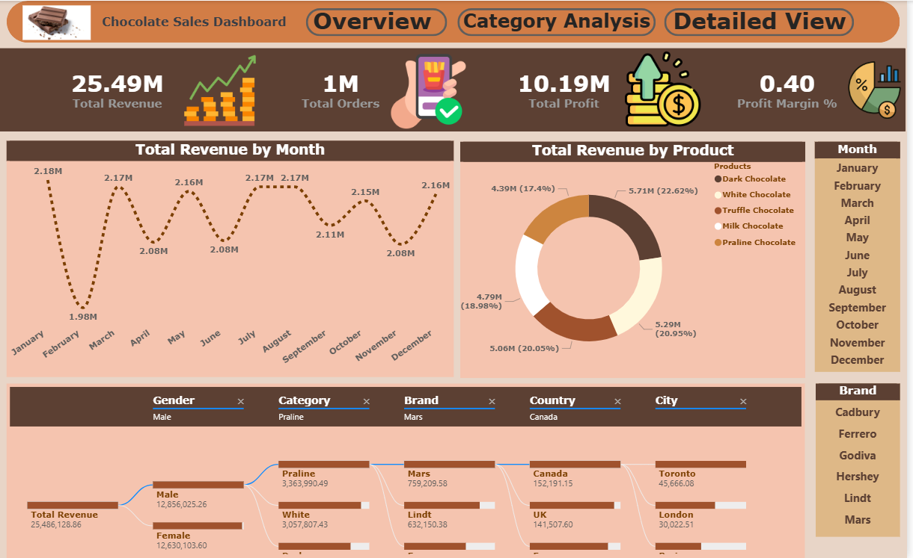
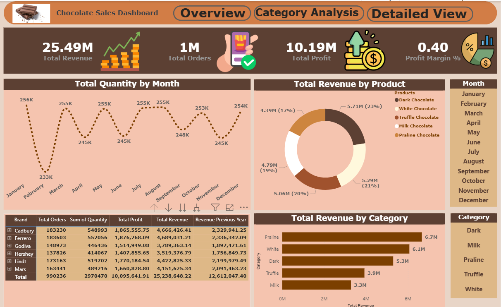
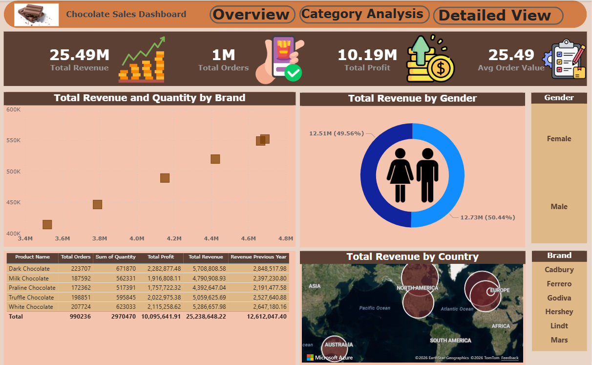

<div align="center">

# 🍫 Chocolate Sales Dashboard — Power BI

### A Professional Business Intelligence Solution for Chocolate Sales Analytics

<br/>


<br/>

> **An end-to-end Power BI dashboard project analyzing chocolate sales performance across brands, categories, countries, and customer demographics — built to deliver actionable business insights through interactive and visually compelling reports.**

<br/>



</div>

---

## 📌 Table of Contents

- [📖 Project Overview](#-project-overview)
- [🎯 Objectives](#-objectives)
- [✨ Features](#-features)
- [🛠 Tools & Technologies](#-tools--technologies)
- [📦 Dataset Information](#-dataset-information)
- [📊 Dashboard Insights](#-dashboard-insights)
- [💡 Key Business Insights](#-key-business-insights)
- [📁 Folder Structure](#-folder-structure)
- [🚀 How to Use](#-how-to-use)
- [🖼 Dashboard Screenshots](#-dashboard-screenshots)
- [📄 Documentation](#-documentation)
- [🔮 Future Improvements](#-future-improvements)
- [🤝 Contributing](#-contributing)
- [📬 Contact](#-contact)

---

## 📖 Project Overview

The **Chocolate Sales Dashboard** is a multi-page Power BI report designed to provide a comprehensive view of sales performance across a global chocolate retail business. The project transforms raw transactional data into meaningful, interactive visual reports that support data-driven decision-making.

This dashboard covers three core analytical perspectives:

| Page | Focus |
|------|-------|
| 🏠 **Overview** | High-level KPIs, monthly trends, brand performance, and revenue by category |
| 🔍 **Category Analysis** | Deep-dive into product-level metrics, gender segmentation, and geographic distribution |
| 📋 **Detailed View** | Granular Sankey-style flow analysis with multi-dimensional slicers |

This project was developed as part of academic coursework under the supervision of **Dr. Shady Abdelhadi** and **Dr. Nouran Amr** at the **Egyptian Russian University (ERU)** — Faculty of Business Technology.

---

## 🎯 Objectives

- 📈 **Track overall sales performance** across total revenue, total orders, profit, and profit margin
- 🏷 **Compare brand-level metrics** — Cadbury, Ferrero, Godiva, Hershey, Lindt, and Mars
- 🍫 **Analyze product categories** — Dark, Milk, White, Praline, and Truffle Chocolate
- 🌍 **Visualize geographic revenue distribution** across multiple countries and continents
- 👥 **Segment sales by customer demographics** including gender and location
- 📅 **Identify seasonal patterns** in monthly revenue and quantity trends
- 💹 **Benchmark current performance** against previous year revenue

---

## ✨ Features

- ✅ **Three interactive report pages** with seamless navigation buttons
- ✅ **Dynamic KPI cards** showing Total Revenue, Total Orders, Total Profit, and Profit Margin
- ✅ **Month and Category slicers** for real-time cross-filtering
- ✅ **Donut chart** — Revenue breakdown by product type
- ✅ **Clustered bar chart** — Revenue by chocolate category
- ✅ **Line chart** — Monthly quantity and revenue trends
- ✅ **Scatter chart** — Revenue vs. quantity correlation by brand
- ✅ **Gender donut chart** — Revenue split between male and female customers
- ✅ **Azure Maps visual** — Geographic revenue heatmap by country
- ✅ **Sankey-style decomposition tree** — Multi-level revenue flow analysis
- ✅ **Detailed data table** — Granular breakdown by brand and product
- ✅ **Consistent chocolate-themed color palette** with a warm, professional aesthetic

---

## 🛠 Tools & Technologies

| Tool / Technology | Purpose |
|-------------------|---------|
| **Microsoft Power BI Desktop** | Report design, data modeling, and visualization |
| **Power Query (M Language)** | Data transformation and cleaning |
| **DAX (Data Analysis Expressions)** | Custom measures and calculated columns |
| **Microsoft Excel** | Raw dataset source |
| **Azure Maps** | Geographic revenue visualization |
| **GitHub** | Version control and portfolio hosting |

---

## 📦 Dataset Information

The dataset represents transactional sales records from a multi-national chocolate retail company. It contains the following key fields:

| Field | Description |
|-------|-------------|
| `Product Name` | Type of chocolate product |
| `Brand` | Chocolate brand (Cadbury, Ferrero, Godiva, Hershey, Lindt, Mars) |
| `Category` | Product category (Dark, Milk, White, Praline, Truffle) |
| `Total Orders` | Number of sales orders |
| `Sum of Quantity` | Units sold |
| `Total Revenue` | Current year revenue |
| `Revenue Previous Year` | Prior year revenue for YoY comparison |
| `Total Profit` | Net profit generated |
| `Gender` | Customer gender segment |
| `Country / City` | Geographic location of sales |

> 📂 The dataset files are stored in the `Chocolate-Sales-Datasets/` folder.

---

## 📊 Dashboard Insights

### 🏠 Overview Page

The Overview page provides a bird's-eye view of the entire business performance:

- **Total Revenue**: 25.49M | **Total Orders**: 1M | **Total Profit**: 10.19M | **Profit Margin**: 0.40%
- Monthly quantity trends reveal a recurring **dip in February and June**, with recovery peaks in January, March, May, and July
- **Praline** leads all categories with **6.7M in revenue**, followed by White (6.1M) and Dark (5.3M)
- **Dark Chocolate** holds the highest product share at **23%** of total revenue
- All six brands perform comparably, with Ferrero slightly ahead at **4.69M revenue**

### 🔍 Category Analysis Page

- **Gender split is nearly equal** — Male (50.44%) vs. Female (49.56%), indicating broad cross-gender appeal
- A scatter plot reveals a **strong positive correlation** between total quantity sold and revenue across brands
- **North America and Europe** are the dominant revenue-generating regions based on the Azure Map distribution

### 📋 Detailed View Page

- The Sankey decomposition tree maps the complete revenue journey: **Total Revenue → Gender → Category → Brand → Country → City**
- Filtering by **Male → Praline → Mars → Canada → Toronto** surfaces a revenue stream of **45,666.08**
- The flow chart enables analysts to pinpoint exactly which customer segments and geographies drive the most value

---

## 💡 Key Business Insights

> The following insights are derived from patterns observed across all three dashboard pages:

1. **🍫 Dark Chocolate Dominates Product Revenue** — With 23% of total revenue, Dark Chocolate is the highest-grossing product and should be prioritized in promotional campaigns.

2. **📅 Seasonal Dips Require Attention** — February consistently underperforms across both quantity and revenue metrics. A seasonal promotion strategy could mitigate this pattern.

3. **⚖️ Gender Parity Presents Opportunity** — The near-equal revenue split (Male 50.44% / Female 49.56%) suggests an opportunity to develop gender-specific marketing without alienating either segment.

4. **🌍 Geographic Concentration** — Revenue is heavily concentrated in North America and Europe. Expansion strategies targeting Asia and South America could unlock significant growth.

5. **🏆 Brand Performance is Tightly Clustered** — All brands perform within a similar revenue band (~3.7M–4.7M), suggesting that no single brand holds a decisive competitive advantage. Strategic differentiation is a priority.

6. **📈 Praline is the Fastest-Growing Category** — Praline chocolate leads category revenue at 6.7M, suggesting strong consumer demand that warrants expanded product lines.

7. **💰 Profit Margin Monitoring** — A 0.40% profit margin warrants close attention to cost structures, particularly for lower-margin brands like Hershey (lowest profit at 3.52M).

---

## 📁 Folder Structure

```
📦 Chocolate-Sales-Dashboard/
│
├── 📂 Assets/
│   ├── Overview_Page.png           # Screenshot — Overview dashboard page
│   ├── Category_Analysis.png       # Screenshot — Category Analysis page
│   ├── Detailed_View.png           # Screenshot — Detailed View page
│   └── ERD_Diagram.png             # Main preview image for README
│
├── 📂 Chocolate-Sales-Datasets/
│   └── chocolate_sales_data.xlsx   # Raw dataset used in the dashboard
│
├── 📂 Dashboard/
│   └── Chocolate_Sales.pbix        # Power BI Desktop report file
│
├── 📂 Docs/
│   └── Project_Documentation.pdf   # Full project documentation and report
│
└── 📄 README.md                    # Project README (this file)
```

---

## 🚀 How to Use

Follow these steps to explore the dashboard on your local machine:

### Prerequisites

- ✅ [Power BI Desktop](https://powerbi.microsoft.com/desktop/) installed (free)
- ✅ Microsoft Windows (Power BI Desktop is Windows-only)
- ✅ Git installed (optional, for cloning)

### Steps

**1. Clone the Repository**

```bash
git clone https://github.com/Mohanad234128/Chocolate-Sales-Dashboard.git
cd Chocolate-Sales-Dashboard
```

**2. Open the Power BI File**

```
Dashboard/Chocolate_Sales.pbix
```

Double-click the `.pbix` file or open it from within Power BI Desktop via **File → Open**.

**3. Explore the Dashboard**

- Use the **navigation buttons** at the top (Overview / Category Analysis / Detailed View) to switch between pages
- Apply **Month and Category slicers** on the right panel to filter data dynamically
- Hover over visuals for **tooltips** with detailed data breakdowns
- Click on chart elements to **cross-filter** other visuals on the same page

**4. Refresh Data (Optional)**

If you modify the dataset:

```
Home → Transform Data → Close & Apply
```

---

## 🖼 Dashboard Screenshots

<br/>

### 🏠 Overview Page
> KPIs, monthly trends, brand performance table, and revenue by product/category


---

### 🔍 Category Analysis Page
> Brand scatter analysis, gender segmentation, and global revenue map



---

### 📋 Detailed View Page
> Sankey-style revenue decomposition with multi-dimensional slicers



> 📸 All screenshots are stored in the `Assets/` folder.

---

## 📄 Documentation

The full project documentation is available in the `Docs/` folder and covers:

- 📌 Project scope and objectives
- 🧹 Data cleaning and transformation steps (Power Query)
- 📐 Data model and table relationships
- 🔢 DAX measures and calculated columns
- 🎨 Design decisions and theme selection
- 📊 Visual-by-visual explanation
- 📝 Conclusions and business recommendations

```
📂 Docs/
└── Project_Documentation.pdf
```

---

## 🔮 Future Improvements

The following enhancements are planned for future versions of this project:

| # | Improvement | Priority |
|---|-------------|----------|
| 1 | 🔗 Connect to a live SQL Server database for real-time data refresh | High |
| 2 | 📱 Optimize layout for Power BI Mobile app | Medium |
| 3 | 🤖 Integrate Power BI Q&A for natural language queries | Medium |
| 4 | 📧 Set up automated email report delivery via Power BI Service | High |
| 5 | 🔮 Add forecasting visuals using Power BI's built-in analytics | Medium |
| 6 | 🌐 Publish to Power BI Service for cloud-based sharing | High |
| 7 | 🧮 Build a customer RFM (Recency, Frequency, Monetary) segmentation model | Low |
| 8 | 📈 Add Year-over-Year growth rate KPIs with conditional formatting | Medium |

---

## 🤝 Contributing

Contributions, suggestions, and feedback are welcome! Here's how you can help:

1. **Fork** this repository
2. **Create** a new branch: `git checkout -b feature/your-feature-name`
3. **Commit** your changes: `git commit -m "Add: your feature description"`
4. **Push** to the branch: `git push origin feature/your-feature-name`
5. **Open** a Pull Request

Please ensure your contributions align with the project's design language and documentation standards.

---

## 📬 Contact

<div align="center">

**Mohanad Ibrahim Elsayed Elbadawy**
*Business Analytics Student — Egyptian Russian University (ERU)*
*Data Analyst | Power BI Developer | Python & SQL Enthusiast*

<br/>

[](https://www.linkedin.com/in/mohanad-ibrahim-business-analytics)
[](https://github.com/Mohanad234128)
[](https://www.kaggle.com/mohanadhonda)
[](mailto:mohanad.elsehrawy@gmail.com)

</div>

---

<div align="center">

## ⭐ Support This Project

If you found this project useful, informative, or inspiring — please consider giving it a **star** on GitHub!

It helps others discover the project and motivates further development. 🙏

[](https://github.com/Mohanad234128/Chocolate-Sales-Dashboard)

<br/>

*Built with ❤️ and a lot of 🍫 by Mohanad Ibrahim*

---

> *"Without data, you're just another person with an opinion."* — W. Edwards Deming

</div>
